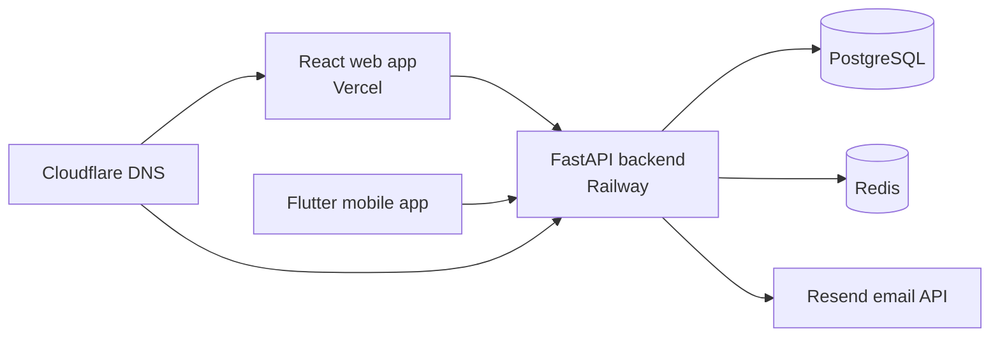

# Architecture

This project is a monorepo for a clinic management platform with separate web,
mobile, backend, and infrastructure layers.

## System Overview



## Applications

- `frontend/` contains the React web dashboard for admins, doctors, and patients.
- `backend/` contains the FastAPI API, authentication, business modules, and database migrations.
- `mobile/hospital_app/` contains the Flutter mobile client.
- `compose.yaml` runs the local development stack with API, frontend, PostgreSQL, Redis, pgAdmin, and seed support.

## Backend Layout

```text
backend/
├── app/
│   ├── core/        # Configuration, database, security, email, logging, middleware
│   └── modules/     # Feature modules such as auth, patients, appointments, messages
├── migrations/      # Alembic migration files
├── requirements.txt
└── seed.py
```

Each backend module usually contains:

- `models.py` for SQLAlchemy models.
- `schemas.py` for Pydantic request and response schemas.
- `router.py` for HTTP endpoints.
- `ws.py` for WebSocket endpoints where needed.

For future growth, large modules should move business logic from routers into
`service.py` and database-specific queries into `repository.py`.

## Frontend Layout

```text
frontend/src/
├── components/  # Reusable UI components
├── context/     # React context providers
├── layouts/     # App shell and navigation layout
├── pages/       # Route-level screens
├── routes/      # Router configuration
├── services/    # API client
└── utils/       # Shared helpers
```

The current layout is simple and works well for the project size. As the app
grows, feature folders such as `features/appointments`, `features/messages`, and
`features/patients` would keep related pages, components, hooks, and API calls
together.

## Mobile Layout

```text
mobile/hospital_app/lib/
├── features/data/
│   ├── models/
│   └── repositories/
└── features/presentation/
    ├── bloc/
    └── screens/
```

The mobile app follows a layered Flutter structure with data models,
repositories, BLoC state management, and presentation screens.

## Data Flow

1. A user signs in from the web or mobile client.
2. The client stores JWT access and refresh tokens.
3. API requests are sent to FastAPI with the access token.
4. FastAPI validates permissions, reads or writes PostgreSQL data, and optionally uses Redis or Resend.
5. Real-time messaging and notification features use WebSocket endpoints.

## Deployment

- Web frontend: Vercel
- Backend API: Railway
- Database: Railway PostgreSQL
- Cache: Railway Redis
- DNS: Cloudflare
- Email: Resend
